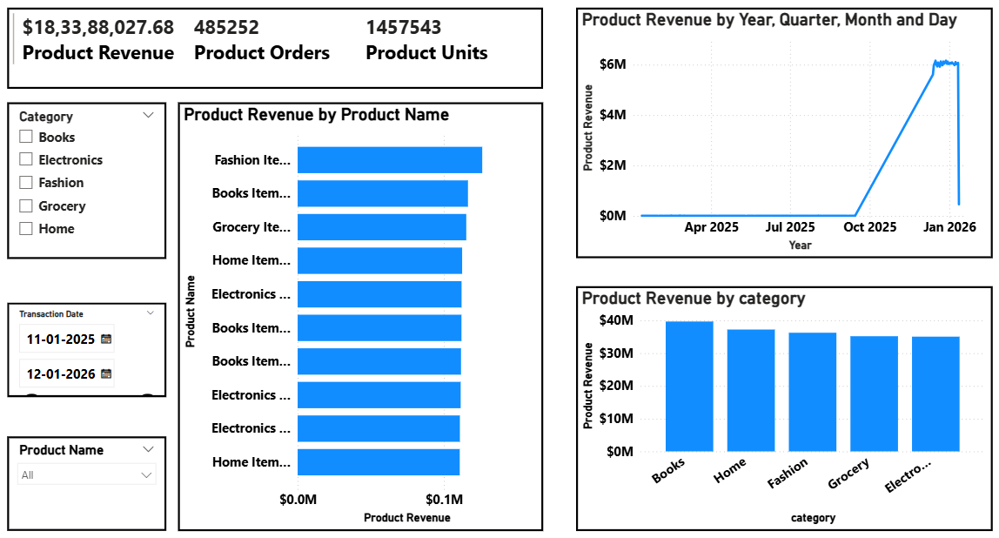
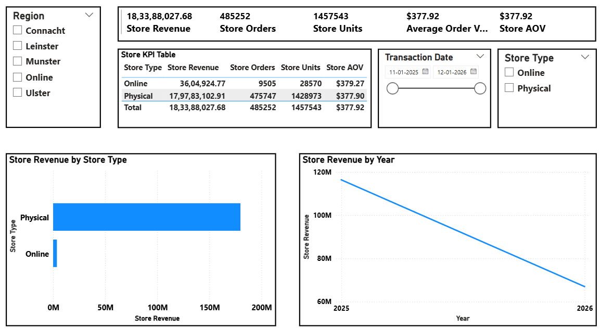

# 🏗️ Retail Lakehouse Project  
**Databricks • Apache Airflow • Delta Lake • Power BI**

---

## 📌 Project Overview

This project implements a **production-grade Retail Data Lakehouse** using **Databricks**, **Apache Airflow**, **Delta Lake**, and **Power BI**, following a **Bronze → Silver → Gold** architecture with an automated **Data Quality (DQ) Gate**.

The solution demonstrates how raw transactional data can be ingested, validated, orchestrated, audited, and transformed into **trusted, analytics-ready datasets**, closely mirroring real-world enterprise data platforms.

---

## 🎯 Key Objectives

- Build a scalable **Lakehouse architecture**
- Separate raw, clean, and business-ready data layers
- Enforce **data quality checks before analytics**
- Orchestrate pipelines using **Apache Airflow**
- Enable **safe reruns, observability, and failure handling**
- Deliver **Power BI–ready Gold datasets**

---

## 🧱 Technology Stack

- **Databricks** – Data processing & Delta Lake storage  
- **Apache Airflow (Dockerized)** – External orchestration  
- **Delta Lake** – ACID-compliant storage layers  
- **Power BI** – Analytics and visualization  
- **Python / PySpark** – Transformations and data quality logic  

---

## 🏛️ High-Level Architecture

```text
Synthetic Retail Data
(Generated Transactions)
        ↓
Bronze Layer
Raw Delta Tables
(Immutable Ingestion)
        ↓
Silver Layer
Cleaned & Validated Data
(Deduplication, Parsing)
        ↓
Data Quality Gate
Validation Rules
(Fail / Pass Thresholds)
        ↓
Gold Layer
Business Aggregations
(BI-Optimized Tables)
        ↓
Power BI Dashboards
Reporting & Insights
```

---

## 📂 Repository Structure (Overview)

```text
retail-lakehouse/
├── airflow/
│   ├── dags/               → Airflow DAGs
│   ├── Dockerfile          → Airflow image
│   └── docker-compose.yml  → Local orchestration
├── notebooks/
│   ├── bronze/             → Raw ingestion
│   ├── silver/             → Cleaning & DQ
│   └── gold/               → Aggregations
├── data_generator/         → Synthetic data scripts
├── data/                   → Sample/reference data
├── docs/                   → Architecture & DQ docs
├── powerbi/                → Local dashboards
├── README.md
└── .gitignore
```

---

## 🚀 Key Features

Bronze–Silver–Gold Lakehouse architecture

External orchestration using Apache Airflow

Explicit Data Quality Gate before Gold layer

Idempotent, rerunnable pipelines

Power BI–ready analytics datasets

---

## 📊 Analytics Layer

The Gold layer outputs are designed to be directly consumed by **Power BI**, enabling:
- Revenue trends
- Store and product performance
- Customer-level insights
- Channel analysis
---

## 📊 Power BI Dashboards

The Gold-layer datasets produced by the lakehouse are consumed directly by **Power BI** to enable business reporting and analytics.

### Dashboard Highlights

#### Overview Dashboard
 

#### Revenue by Store


#### Product Performance


> Power BI `.pbix` files are intentionally excluded from version control.  
> Screenshots are provided for demonstration purposes.

---

## 🧠 Why This Project Matters

This project goes beyond simple ETL by demonstrating:
- Real-world **data governance practices**
- External orchestration instead of notebook chaining
- Production-style **quality enforcement**
- End-to-end ownership from ingestion to BI

---

## 📌 Notes

- Secrets and environment variables are excluded via `.gitignore`
- Airflow logs and Power BI binaries are kept local only
- Detailed architecture and DQ logic can be found in `/docs`

---

## 👤 Author

**Kamran Habib**  
Data Analytics & Data Engineering Projects 
